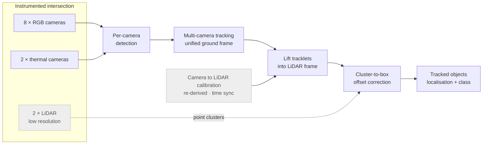

**Derq · Dubai, UAE** &nbsp;·&nbsp; Machine Learning Engineer III — R&D &nbsp;·&nbsp; 2024
&nbsp;·&nbsp;
[Stage 1B winner announcement](https://www.transportation.gov/briefing-room/us-dot-announces-winners-intersection-safety-challenge-stage-1b-system-assessment-and)

The US Department of Transportation's Intersection Safety Challenge asked entrants to track road
users at an instrumented intersection and report them in LiDAR space, scored on localisation and
classification. Derq was named a Stage 1B winner.

Available sensing was eight RGB cameras, two thermal cameras, and two LiDAR units — the last at a
resolution low enough to change the shape of the entire solution.

## Role

The effort spanned an engineering team and an R&D team; I worked in R&D and led the research on
the perception path: camera-to-LiDAR spatial transformation, camera–LiDAR time synchronisation,
object detection in camera feeds, multi-camera tracking in a unified space, lifting tracklets into
LiDAR space, and correcting the residual spatial offset between LiDAR point clusters and the
lifted 3D boxes.

## Approach

The conventional arrangement for a camera–LiDAR system detects in both modalities and fuses the
results. That was not available here. The supplied LiDAR was too sparse to detect reliably on —
vehicles and vulnerable road users at any distance simply did not have the returns to support
detection — so treating it as a detection source would have thrown away range precisely where the
intersection is most safety-critical.

The system therefore runs **camera-primary**: detection and multi-camera tracking happen entirely
in imagery, where resolution is abundant, and LiDAR is demoted from a detection sensor to the
output coordinate frame plus a geometric reference for refinement. Tracks are formed in a unified
ground frame across cameras, lifted into LiDAR space through calibration, and then corrected for
the systematic offset between the lifted boxes and the observed point clusters.

## Challenges

- **LiDAR resolution** ruled out detection at range, forcing the inverted design above.
- **The supplied calibration was poor.** The provided matrices were not accurate enough to lift
  camera tracks into LiDAR space, and every downstream localisation score depended on that
  transform. I re-derived the calibration from scratch. This was unglamorous work that determined
  the outcome — a tracking stack of any quality scores badly through a bad extrinsic.
- **Occlusion and class confusion.** Intersections occlude heavily, VRU classes look alike, and
  the smallest, most safety-relevant classes appear at the greatest distance.

## Outcome

The submission was named a winner of Stage 1B (System Assessment and Demonstration).

**Tech stack** — Python · PyTorch · Multi-camera tracking · Camera–LiDAR calibration · Sensor time
synchronisation
