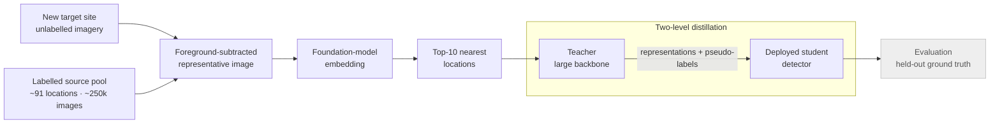

**Derq · Dubai, UAE** &nbsp;·&nbsp; Senior Machine Learning Engineer — research lead
&nbsp;·&nbsp; 2026 — Present

Every new customer intersection is a new visual domain. Camera height and lens, approach
geometry, road layout, surrounding architecture, and prevailing weather all shift the input
distribution, and a detector fine-tuned elsewhere degrades on arrival. The standard remedy is to
collect and annotate imagery from the new site, which costs roughly two weeks per location before
a tuned detector exists. Repeated across every deployment, that latency — not model quality —
becomes the constraint on how fast sites come online.

This work removes the annotation step entirely: no labels are collected at the target site.

## Approach

The method has two halves — retrieval to assemble well-matched labelled data, and distillation to
transfer capability onto unlabelled target imagery.

- **Site retrieval.** Rather than training on the entire labelled pool or hand-picking visually
  similar sites, site selection is posed as a retrieval problem over a pool of approximately 91
  distinct locations and 250,000 labelled images. Each location is reduced to a single
  representative image, embedded with a foundation model, and the ten nearest locations to the
  target are retrieved as the training set.
- **Foreground subtraction before embedding.** The representative image has foreground objects
  removed, so similarity is driven by scene structure, viewpoint, and imaging conditions rather
  than by which vehicles and pedestrians happened to be present at capture time. This is the design
  decision that makes retrieval measure the domain gap that actually matters instead of incidental
  object content.
- **Two-level distillation.** A teacher with a substantially larger backbone — accurate but too
  heavy to deploy at the edge — supervises the deployed student at both the representation level
  and the pseudo-label level, rather than through pseudo-labels alone.

## Results

Evaluation uses held-out ground truth from the location pool, so the absence of target labels
during training does not force a proxy metric at evaluation time. The comparison is against a
production baseline detector trained on roughly 200 locations disjoint from this pool.

| Setting | Target-site labels | Detection mAP |
| --- | --- | --- |
| Baseline detector (~200 disjoint locations) | none | reference |
| Retrieval + two-level distillation | none | **+10–15 points (~50% relative)** |

The improvement is 10 to 15 **points** of mAP, which against this baseline is close to a 50%
relative gain — the baseline is weak on an unseen site, which is precisely the problem being
solved.

That the gain holds across every site evaluated, rather than on average, matters as much as the
magnitude: a domain-adaptation method that helps on average but regresses somewhere cannot be
deployed without per-site validation, which would reintroduce the cost the work exists to remove.

**Tech stack** — Python · PyTorch · Object detection · Foundation-model embeddings · Knowledge
distillation · Domain adaptation
