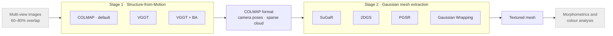

**Georgia Tech · Human-Augment Analytics Group** &nbsp;·&nbsp; Graduate Research Assistant —
Research Master's Project &nbsp;·&nbsp; Advisor: [Dr. Arthur Porto](https://agporto.github.io/markdown-cv/) (PI)
&nbsp;·&nbsp; 2026 — Present &nbsp;·&nbsp;
[Public repository](https://github.com/Human-Augment-Analytics/Porto-photogrammetry-)

Natural-history specimens are digitised so that their geometry and colour can be analysed
statistically — morphometrics across populations, colour analysis across specimens. That
downstream use imposes a requirement most reconstruction work does not carry: the mesh is a
measurement instrument, not a visualisation, so geometric fidelity matters more than perceptual
quality. Commercial photogrammetry tools produce usable meshes but are closed, and the
fast-moving neural reconstruction literature is a collection of incompatible research
repositories rather than something a lab can run.

The goal was an open-source pipeline that makes current neural reconstruction methods
interchangeable and directly comparable on the same specimens.

## Role

I built the pipeline end to end — the Structure-from-Motion adapters, the Gaussian mesh
extraction wrappers, and the orchestration between them — and ran the qualitative evaluation of
every variant against Meshroom (open source) and Reality Scan (commercial).

## Approach

The system is two stages coupled through a single interchange format. Stage one recovers camera
poses and a sparse point cloud; stage two fits Gaussians and extracts a surface. Because the
stages communicate only in COLMAP format, any SfM backend composes with any mesh extractor,
which is what makes a controlled comparison of methods possible at all — the same poses feed
every extractor, so differences in output are attributable to the extractor rather than to
upstream variation.

- **COLMAP as the default SfM backend, despite being the slowest.** VGGT recovers poses in
  roughly 3 minutes against COLMAP's 10, and is the more interesting method. It is not the default
  because it exhausts memory on the 40&nbsp;GB A100 the lab actually runs; COLMAP's incremental
  approach scales within that budget. The transformer's single-pass formulation is precisely what
  costs memory as image count grows, so the constraint is structural rather than an implementation
  detail.
- **Speed and fidelity are separate choices, so both are exposed.** 2DGS is the fastest route to a
  mesh at roughly 40 minutes; Gaussian Wrapping produces the highest fidelity output at roughly 65.
  Rather than collapsing the tradeoff into one default, the pipeline leaves the extractor
  selectable, since a lab iterating on capture protocol and a lab producing final measurements want
  different points on that curve.

## Results

End-to-end wall-clock on 138 images at 6240×4160, single A100 40&nbsp;GB, COLMAP front end:

| Configuration | Wall clock | Note |
| --- | --- | --- |
| COLMAP + 2DGS | **~40 min** | fastest to a mesh |
| COLMAP + Gaussian Wrapping | ~65 min | highest fidelity observed |
| COLMAP + PGSR | ~70 min | |
| COLMAP + SuGaR | ~80 min | |
| Meshroom (baseline) | ~60 min | open-source reference |

Structure-from-Motion in isolation, B200 80&nbsp;GB: COLMAP ~10 min, VGGT ~3 min, VGGT with
bundle adjustment ~15 min.

On geometry, the pipeline reaches **qualitative parity with commercial Reality Scan under visual
inspection**. That claim is deliberately bounded: ground-truth geometry for these specimens is
still being collected, and until it exists there is no Chamfer or Hausdorff figure to quote.
Quantitative validation against that ground truth is the current priority.

  

    
  

  Five viewpoints of one specimen. Top row is the reference photography; below it, commercial
  Reality Scan and open-source Meshroom, then three Gaussian extractors from this pipeline.

**Tech stack** — Python · PyTorch3D · COLMAP · VGGT · 3D Gaussian Splatting
